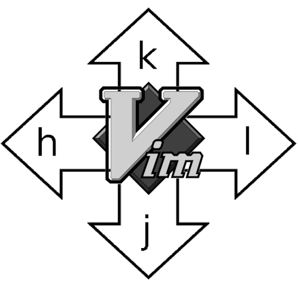
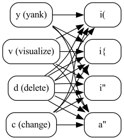

<style>
code {
    font-size: 100% !important;
}
</style>

# Административни неща

* Запишете се в сайта: <https://vim-fmi.bg/>
* Качете си снимка (1 точка)
--
* Инсталирайте си Vim: <https://www.vim.org/download.php>
--
* Хора с опит, хора без...
--
* Хора с лаптопи, хора без...
--
* Упражненията още не са готови, ще пусна новина и announcement в Discord (понеделник?)
* Следете `#announcements` и/или сайта
--
* (`#shitposting` в Discord може да се mute-не. Just sayin')

---

# Hello, world!

Защото винаги от там се почва:

```vim
:echo "Hello World"
```

---

# Команди

* Влиза се в "command-line mode" с `:`
--
* Да не се бърка с "command mode" (объркващо е, да)

---

# Няколко базови команди

--
* `:quit`
--
* `:edit`, `:edit <име-на-файл>`
--
* `:write`
--
* Също могат да се напишат `:q`, `:e`, `:w`
--
* Има вариант с `!` -- `:q!`, `:e!`, `:w!`
--
* `:help` -- Изключително важна!
* `:help!` -- !!!
--
* `:help :edit`
* `:help :help`

---

# Навигация: The holy hjkl



---

# Защо hjkl вместо стрелкички?

* Историческия отговор: защото стрелкичките actually са били тези клавиши
--
* Задържат се, защото са много по-удобни -- j е на показалеца, ако touch-type-ваме "правилно"
--
* Важно: По-удобни са, но не са единственото, иначе заместваме стрелкички с малко по-удобни стрелкички

---

# Големи вертикални движения

* `Ctrl + f` ("forward"), скролира цяла страница напред (`:help ctrl-f`)
* `Ctrl + b`: ("backward"), скролира цяла страница назад (`:help ctrl-b`)
* `:set number` -- за да виждате line numbers, `:set nonumber` ги маха
--
* `Ctrl + u` ("up"), скролира половин страница напред (`:help ctrl-u`)
* `Ctrl + d`: ("down"), скролира половин страница назад (`:help ctrl-d`)
--
* `:help 'scroll'`: Контролира колко actually скролират up/down, не е нужно да е половин
* `:set scroll=4`
--
* Забележете -- вероятно не ви трябват и двата чифта мапинги
* Мнемониките са "training wheels", в един момент няма да имат значение

---

# Големи вертикални движения

* `H` -- High
* `M` -- Middle
* `L` -- Low
* също могат да заместят скролването в комбинация с `j`/`k`

---

# Скачане на конкретни редове

* `gg` -- скача на първия ред
* `G` -- скача на последния ред
--
* `[count]G` -- скача на конкретен ред, примерно `123G`
--
* `[count]gg` -- прави *същото* (механиката е -- и двата мапинга приемат count, единия default-ва на 1, другия на `$`)
--
* `:[count]` също скача на ред -- `:123<enter>`

---

# Скачане на конкретен текст

* `/<search-query>`
* `n`, `N`
--
* използва регекси, за които ще говорим още мнооого, но по-нататък
--
* `?<search-query>` -- "намери ми функция назад" примерно
* Досадно(?) -- посоката на `n` и `N` се обръща
--
* `:set incsearch`
* `:set hlsearch` -- изключвате последния search със `:nohlsearch`
* `*`

---

# Хоризонтално движение: начало и край

* `^` -- до първия не-whitespace символ на реда
* `$` -- до последния символ на реда

Мнемониката са регексите, но са досадно неконсистентни.

--

* `0` -- до самото начало на реда
* `g_` -- до последния не-whitespace символ на реда

Съвет: просто ползвайте `^` и `$`, може би `0` ако ви трябва за някакви whitespace неща. Ще намерите една купчина екзотични неща във `:help left-right-motions`, но не ги мислете много.

---

# Хоризонтално движение: по думи

* `w` (word)
* `b` (back)
* `e` (end)
--
* `ge` (end, ама... наобратно?)
--

Същото, но по whitespace-разделени думи ("WORD" в документацията):

* `W`
* `B`
* `E`
* `gE`

---

# Хоризонтално движение: таргетиране

* `t<char>` - "till char", скача до преди определен символ, примерно `t;`
* `T<char>` - в обратната посока
--
* `f<char>` - същото, но слага курсора *върху* нещото
* `F<char>` - в обратната посока
--
* `;` -- повтаря търсенето в същата посока
* `,` -- повтаря търсенето в обратната посока
* (аналози на `n` и `N`)

---

# Visual mode

* `v` -- characterwise visual mode, удобен за операция върху дребни парчета текст
* `V` -- linewise, за цели блокове код
* `Ctrl-v` -- blockwise, особен, ще го човъркаме после
* `<esc>`/`ctrl-[` -- излиза от visual mode (и повечето други режими)

--

Всичко, което ползваме за *навигация*, може да се ползва във Visual mode

--

...и още

* `i(` -- селектирай "in" скобки
* `a(` -- селектирай "around" скобки
--
* `i"` -- селектирай "in" кавички
* `a"` -- селектирай "around" кавички
--
* ... и още: `:help text-objects`

---

# Visual mode

* `o` -- сменя позицията на курсора от единия край на visual mode до другия
* удобно за ad-hoc разширяване на селекция
--
* Какво правим като селектираме? Hold that thought, първо малко insert mode

---

# Insert mode

Най-накрая, можем да пишем неща.

* `i` -- влиза в insert mode *преди* курсора ("insert")
* `a` -- влиза в insert mode *след* курсора ("append")
* `o` -- отваря ("open") нов ред отдолу
* `O` -- отваря ("open") нов ред отгоре
* `<esc>`/`ctrl-[` -- излиза от insert mode

--

пишем, пишем и *веднага* излизаме в normal mode. This is the way.

--

* `u` -- undo
* `Ctrl-r` -- redo
* `.` -- повтаря същата операция

---

# Действия във visual mode

* `d` -- изтрива ("delete")
* `y` -- копира ("yank")
* `p` -- пейства ("put")
* `c` -- променя ("change") -- тоест, изтрива и оставя в insert mode

---

# Fun fact: не ви трябва visual mode



---

# Ключови неща

--
* Да можете да навигирате от където и да е до където и да е
--
* Да можете да таргетирате област
--
* Да можете да променяте "на части" -- insert → писане → `<esc>`
