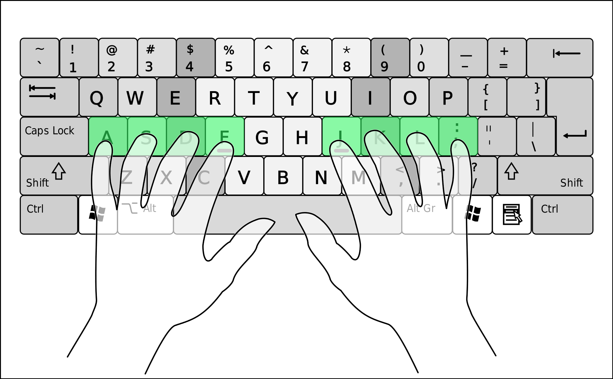

<style>
code {
    font-size: 100% !important;
}
</style>

# Административни неща

* Упражнения за всички, all day, every day
* Днешната версия: 0.1.14

---

# Клавиатурни неща



---

# Клавиатурни неща

Съвети:

* Дръжте пръстите на home row, опитвайте се да натискате с "правилния" пръст
* По-важно: цъкайте на модификатор + клавиш на *противоположни* страни
    * `<c-w>`: десен контрол, `w` с безименния пръст
    * `<c-r>`: десен контрол, `r` с показалец
    * А: десен shift, кутре на `a`
* (Някои неща и аз ги правя грешно, perfect is the enemy of good)
* Когато си пишете мапинги, опитвайте се да алтернират лява/дясна ръка

---

# Клавиатурни неща

Ремапвания

* Caps lock е чудесен Ctrl клавиш
* (Някои хора слагат Esc на Caps lock)
* Направете си удобен десен Ctrl
--
* Windows: AutoHotkey (макар че с гугълване намерих и други неща)
* Linux: <https://wiki.archlinux.org/title/Xorg/Keyboard_configuration#Swapping_Caps_Lock_with_Left_Control>
* Mac: Karabiner?

---

# Малко мапинги

```vim
nnoremap zj yyp
nnoremap zk yyP
```

---

# Aside: Marks

`:help mark-motions`


---

# Мапинга отново

```vim
nnoremap zj mayyp`aj
nnoremap zk mayyP`ak
```

* Запази текущия курсор в mark "a"
* Копирай текущия ред и го пейстни отдолу/отгоре
* Върни се на марк "a"
* (опционално) Премести се надолу/нагоре

---

# Малко скриптиране

Знаем за мапинги, знаем за прозорци, знаем за регистри

```vim
nnoremap <c-w>d :call DeleteWindow()<cr>
nnoremap <c-w>y :call YankWindow()<cr>
nnoremap <c-w>p :call PasteWindow()<cr>
```

---

# What did we learn?

* Дефиниране на функции и разни техни quirk-ове (има и още)
--
* Scope-ове на променливи (и още ще видим)
--
* Регистри във функции
--
* `execute`/`exe`
--
* Vimscript е малко странен (но и по-странни неща има на тоя свят)

---

# Файлове: Netrw ("Net read/write")

`:help netrw`

* Редактиране на пътища през ssh и ftp
--
* `:Explore`/`:Ex`, `:Hex`, `:Vex` или `:Lex`
--
* Мапинги: `:help netrw-quickmaps`

---

# Файлове: Netrw ("Net read/write")

Препоръчителни настройки, може би:

```vim
let g:netrw_liststyle = 3  " дървовидно
let g:netrw_banner    = 0  " без банер (`I` го показва)
let g:netrw_winsize   = 20 " по-малък прозорец
```

Нямам много опит с netrw, но е свикваем.

---

# Базова терминология

* "File": На файловата система
* "Buffer": Каквото е заредено в паметта на Vim
* "Window": Прозорец, който показва конкретен буфер
* "Tab": Екран, на който са наредени прозорци

---

# Буфери

* `:help :buffers` (`:help :ls`)
--
* `2buffer`, `buffer 5`
--
* `:help :hide`, `:help :bdelete`
--
* `:help bufhidden`, ако много искате да "зачиствате"

Във vimscript:

* `:help tabpagebuflist()`
* `:help bufnr()`

---

# Aside: Linediff

* <https://github.com/AndrewRadev/linediff.vim>
* Използва `:buffer`, `bufhidden`
* `:help vimdiff`, `:help diffthis`, `:help diffoff`

---

# Буфери: encoding

* `:e ++enc=cp1251`
* `:w ++enc=utf8`

---

# Буфери: args

* `:help args`
--
* `:help :next`, `:help :prev`
--
* `:help :argadd`, `:help :argdelete`, `:%argdelete` -- изтрива всичко
--
* `:help :argdo`

---

# Altogether now

```vim
:args *.srt
:argdo edit ++enc=cp1251 | write ++enc=utf8
```

---

# Range-ове

* `2copy 3` -- копира ред 2 след ред 3
--
* `2,5copy 8` -- копира редoве 2 до 5 след ред 8
--
* `.,.+3copy 20` -- копира от текущия ред до след 3 реда след ред 20
* `.-1,.+1copy 20` -- копира от предния ред до следващия ред след ред 20
--
* `%` -- целия файл
* `$` -- последния ред
--
* `'a,'bcopy $`
--
* `'<,'>copy $`

---

# Първи поглед върху :substitute

`:help substitute`

* `:s/pattern/substitution` -- върху един ред, първото срещане
--
* `:s/pattern/substitution/g` -- върху един ред, всички срещания (`/g`)
--
* `:%s/pattern/substitution/g` -- върху всички редове (`%`), всички срещания
--
* `:'<,'>s/pattern/substitution/g` -- върху визуалната селекция (по редове), всички срещания

---

# :vimgrep

`:help :vimgrep`

* `:vimgrep /pattern/ file1.txt file2.txt`
--
* `:vimgrep /pattern/ *` -- търси във всички файлове в директорията
--
* `:vimgrep /pattern/ */**` -- същото, но рекурсивно
--
* Бавно е, има по-добри начини за големи проекти. Но става за демонстрации.

---

# Quickfix

`:help quickfix`

* `:copen`, `:cclose` -- отваря прозорчето
--
* `:cnext`, `:cprev`
--
* `:colder`, `:cnewer` -- супер полезни

---

# Да си направим `:Grep`

```vim
command! Grep call Grep(<q-args>)
```

... другия път :)
